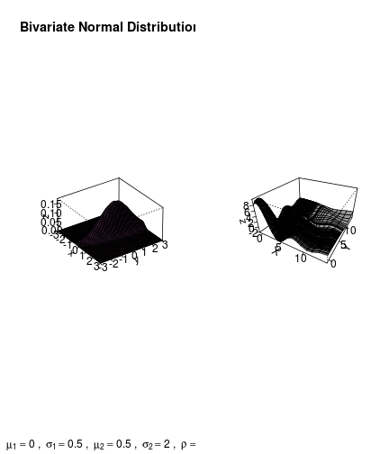
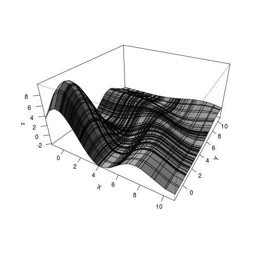
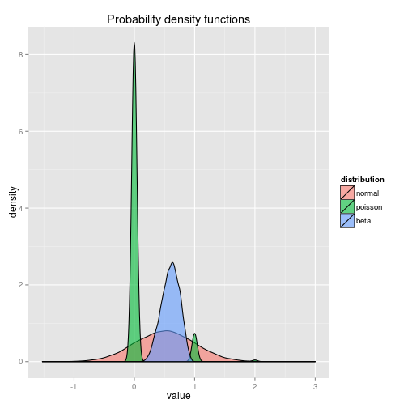
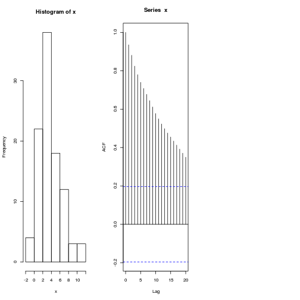
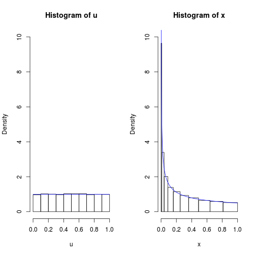
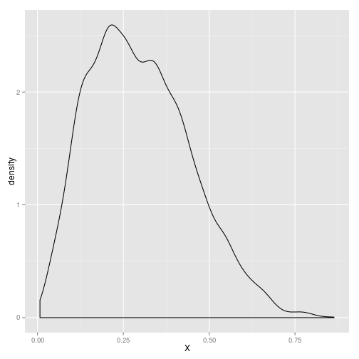
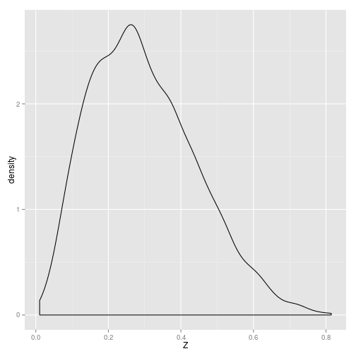
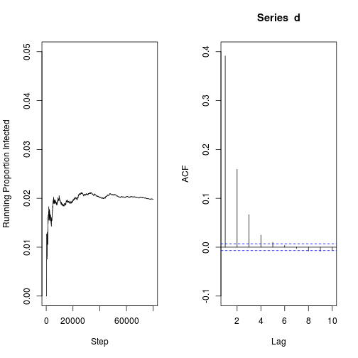
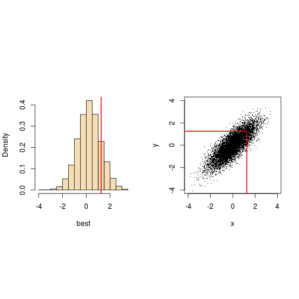
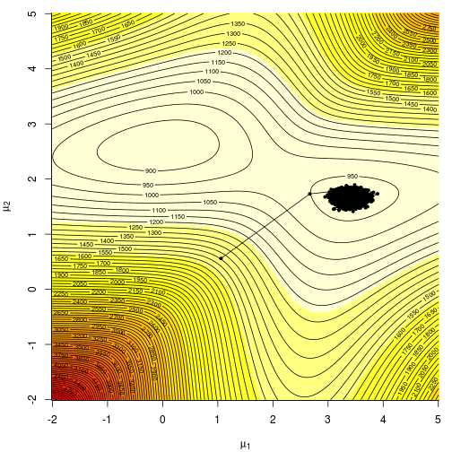

# Markov Chain Monte Carlo simulation components

## bivariate normal distribution

A bivariate normal distribution. Could also simulate this using the MASS library (mvnorm)


```r
mu1 <- 0  # expected value of x
mu2 <- 0.5  # expected value of y
sig1 <- 0.5  # variance of x
sig2 <- 2  # variance of y
rho <- 0.5  # corr(x, y)

### Some additional variables for x-axis and y-axis
xm <- -3
xp <- 3
ym <- -3
yp <- 3

x <- seq(xm, xp, length = as.integer((xp + abs(xm)) * 10))  # vector series x
y <- seq(ym, yp, length = as.integer((yp + abs(ym)) * 10))  # vector series y

### Core function
bivariate <- function(x, y) {
    term1 <- 1/(2 * pi * sig1 * sig2 * sqrt(1 - rho^2))
    term2 <- (x - mu1)^2/sig1^2
    term3 <- -(2 * rho * (x - mu1) * (y - mu2))/(sig1 * sig2)
    term4 <- (y - mu2)^2/sig2^2
    z <- term2 + term3 + term4
    term5 <- exp((-z/(2 * (1 - rho^2))))
    return(term1 * exp(-z * (2 * (1 - rho^2))))
}

### Computes the density values
z <- outer(x, y, bivariate)

### Plot
persp(x, y, z, main = "Bivariate Normal Distribution", sub = bquote(bold(mu[1]) == 
    .(mu1) ~ ", " ~ sigma[1] == .(sig1) ~ ", " ~ mu[2] == .(mu2) ~ ", " ~ sigma[2] == 
    .(sig2) ~ ", " ~ rho == .(rho)), col = "orchid2", theta = 55, phi = 30, 
    r = 40, d = 0.1, expand = 0.5, ltheta = 90, lphi = 180, shade = 0.4, ticktype = "detailed", 
    nticks = 5)
```

 


## Curved and folded surfaces - not normal


```r
require(ggplot2)
require(reshape2)
require(gridExtra)
n = 100
x = y = (scat <- sort(rnorm(n) + rchisq(n, df = 4)))
fun <- function(x, y) {
    r <- sqrt(x^2 + y^2)
    10 * sin(r)/r
}
z <- outer(x, y, fun)
scat.df <- data.frame(x = x, y = x, z = z)

p = persp(x, y, z, theta = 30, phi = 30, expand = 0.5, shade = 0.75, ticktype = "detailed", 
    xlab = "X", ylab = "Y")
```

 


## Probability density functions

```r
library(ggplot2)
library(reshape2)
nval = 10^4
normal <- rnorm(nval, 0.5, 0.5)
pois <- rpois(nval, 0.1)
beta <- rbeta(nval, 6, 4)
dist <- data.frame(normal = normal, poisson = pois, beta = beta)
dist_m <- melt(dist)
```

```
## Using as id variables
```

```r
names(dist_m) <- c("distribution", "value")
ggplot(dist_m, aes(x = value, fill = distribution)) + geom_density(alpha = 0.6) + 
    ggtitle("Probability density functions")
```

 


## Random sampling in R

This is meant to show that there is very little correlation between random numbers generated in R.


```r

x = runif(Nsim)
```

```
## Error: object 'Nsim' not found
```

```r

x2 = x[-1]
par(mfrow = c(1, 3))
hist(x)
plot(x1, x2)
```

```
## Error: error in evaluating the argument 'x' in selecting a method for
## function 'plot': Error: object 'x1' not found
```

```r
acf(x)
```

 


## Using uniform distribution to generate a beta distribution

This comes from [@suess_introduction_2010, 32].

> A real function of a random variable is another random variable. Random variables with a wide variety of distributions can be obtained by transforming a standard uniform random variable $U \approx UNIF(0, 1)$ 
. Let $U \approx UNIF(0, 1)$.
> ... We seek the distribution of $X = U^2$ [@suess_introduction_2010, 32].

The example uses a uniform random variable to create a beta distribution.


```r
set.seed(1234)
m = 10000
u = runif(m)
x = u^2
xx = seq(0, 1, by = 0.001)
cut.u = (0:10)/10
cut.x = cut.u^2
par(mfrow = c(1, 2))
hist(u, breaks = cut.u, prob = T, ylim = c(0, 10))
lines(xx, dunif(xx), col = "blue")
hist(x, breaks = cut.x, prob = T, ylim = c(0, 10))
lines(xx, 0.5 * xx^-0.5, col = "blue")
```

 

```r
par(mfrow = c(1, 1))
```

  
  
## Use inverse transform to generate distribution


A uniform random variable can be used to generate an arbitrary distribution using the the inverse probability transform. 

$cos(2\theta)=\int{\frac{a}{b}}$

where $F$ is the cumulative distribution function (cdf),
For instance, to generate an exponential random variable

```r
Nsim = 10^5
U = runif(Nsim)
X = -log(U)  #
Y = rexp(Nsim)
par(mfrow = c(1, 2))
hist(X, freq = F, main = "Exp from uniform", breaks = 20)
hist(Y, freq = F, main = "Exp from R", breaks = 20)
```

 


## Another demo of use of inverse transform

The point is that a supply of random variables can be used to generate different distribution; [@robert_introducing_2010,p.44]

```r

Nsim = 10^5
mu = 0.4
beta = 0.4
U = runif(Nsim)
X = -mu + beta * (log((1 - U)/U))  #I had to verify this by solving the cdf for X
Y = rlogis(Nsim, location = mu, scale = beta)
par(mfrow = c(1, 2))
hist(X, freq = F, main = "Logistic from uniform")
hist(Y, freq = F, main = "Logistic from R")
```

 


  

## Accept-reject method to simulate beta

[@robert_introducing_2010, 53-54], but code taken from mcms package

 

## Markov-chain random walk to generate normal distribution


'Consider the Markov chain defined by X(t+1) = sigmaX(t) + epsilon(t) where epsilon(t) ~ Normal(0,1)', [@robert_introducing_2010, p.169]


```r
X <- vector(length = 10^4)
X[1] = runif(1)
sigma = 0.9
for (t in 1:10^4) {
    X[t + 1] = sigma * X[t] + runif(1, min = 0, max = 1)
}
Y = rnorm(10^4, 0, 1/(1 - sigma^2))
par(mfrow = c(1, 2))
hist(X, breaks = 200, freq = F, main = "Markov chain generated normal")
hist(Y, breaks = 200, freq = F, main = "Stationary distribution")
```

 


## Beta distribution generated using Metropolis-Hastings algorithm

To simulate a beta distribution: 'we can just as well use a Metropolis-Hastings algorithm, where the target density f is the Be(2.7,6.3) density and the candidate q is uniform over [0,1]'  [@robert_introducing_2010,p.172]


```r

a = 2.7
b = 6.3
c = 2.669
Nsim = 5000
X = rep(runif(1), Nsim)
accept <- vector(mode = "logical", length = Nsim)
for (i in 2:Nsim) {
    Y = runif(1)
    rho = dbeta(Y, a, b)/dbeta(X[i - 1], a, b)
    accept[i] = runif(1) < rho
    X[i] = X[i - 1] + (Y - X[i - 1]) * (accept[i])
    
}

Z = rbeta(5000, a, b)
par(mfrow = c(1, 2))
hist(X, freq = F, breaks = 200, main = "Sample generated by Metropolis-Hastings")
hist(Z, freq = F, breaks = 200, main = "Sample generated by exact iid")
```

 

```r
print(ks.test(jitter(X), rbeta(5000, a, b)))
```

```
## 
## 	Two-sample Kolmogorov-Smirnov test
## 
## data:  jitter(X) and rbeta(5000, a, b) 
## D = 0.0198, p-value = 0.2809
## alternative hypothesis: two-sided
```

```r
X.df <- data.frame(X = X, Z = Z)

ggplot(X.df, aes(x = X)) + geom_density()
```

 

```r
ggplot(X.df, aes(x = Z)) + geom_density()
```

 

Note the acceptance rate on this: **45.72%**.


## Two-stage Gibbs sampling

Two-stage gibbs sampler

Gibbs_pair_of_distributions_example7_2 from [@robert_introducing_2010]
  
  

```r
Nsim = 5000
n = 15
a = 3
b = 7
X = T = array(0, dim = c(Nsim, 1))
T[1] = rbeta(1, a, b)
X[1] = rbinom(1, n, T[1])
for (i in 2:Nsim) {
    X[i] = rbinom(1, n, T[i - 1])
    T[i] = rbeta(1, a + X[i], n - X[i] + b)
}
par(mfrow = c(1, 2))
hist(T, freq = F, main = "theta")
hist(X, freq = F, main = "X")
```

 


## 6.4 A Simple Gibbs Sampler

This sampler implements a screening test. It comes from [@suess_introduction_2010]

Variable|Value
-------|-------------
D|the proportion of infected population. 
T|the proportion of population that tests positive. 
eta |sensitivity of the test (correctly identified positives)
theta|specificity of the test (correctly identified negatives)
gamma|predictive value of a positive test
delta|predictive value of a negative test


```r
m = 80000
eta = 0.99
theta = 0.97
gamma = 0.4024
delta = 0.9998
d = numeric(m)
d[1] = 0
t = numeric(m)

for (n in 2:m) {
    if (d[n - 1] == 1) 
        t[n - 1] = rbinom(1, 1, eta) else t[n - 1] = rbinom(1, 1, 1 - theta)
    
    if (t[n - 1] == 1) 
        d[n] = rbinom(1, 1, gamma) else d[n] = rbinom(1, 1, 1 - delta)
}

runprop = cumsum(d)/1:m
mean(d[m/2 + 1]:m)
```

```
## [1] 40000
```

```r

par(mfrow = c(1, 2))
plot(runprop, type = "l", ylim = c(0, 0.05), xlab = "Step", ylab = "Running Proportion Infected")
acf(d, ylim = c(-0.1, 0.4), xlim = c(1, 10))
```

 

```r
par(mfrow = c(1, 1))
acf(d, plot = F)
```

```
## 
## Autocorrelations of series 'd', by lag
## 
##      0      1      2      3      4      5      6      7      8      9 
##  1.000  0.406  0.162  0.068  0.025  0.009  0.002  0.004  0.001 -0.001 
##     10     11     12     13     14     15     16     17     18     19 
##  0.006  0.007  0.005  0.007  0.003  0.005  0.002 -0.001  0.000  0.001 
##     20     21     22     23     24     25     26     27     28     29 
##  0.004 -0.001 -0.006 -0.008 -0.007 -0.001  0.001  0.005  0.003  0.003 
##     30     31     32     33     34     35     36     37     38     39 
##  0.001  0.001 -0.001  0.001  0.002  0.001 -0.002 -0.004 -0.005 -0.007 
##     40     41     42     43     44     45     46     47     48     49 
## -0.007 -0.006 -0.006 -0.002  0.005  0.009  0.007  0.002 -0.001  0.002
```

```r

```


## Simulation by sampling

Imagine trying to work out how likely we are to get 90 good chips in batch of 100 from a production line where we know that 5 in every 100 chips are faulty. There are two ways of doing it. The first is analytical. 


```r


choose(90, 5)/choose(100, 5)
```

```
## [1] 0.5838
```


The second way is to simulate a sample of the chips, and calculate the probability of getting 90% good ones:


```r


set.seed(1237)
m = 1e+05
good = numeric(m)

for (i in 1:m) {
    pick = sample(1:100, 5)
    good[i] = sum(pick <= 90)
}

mean(good == 5)
```

```
## [1] 0.5829
```

```r
good.df <- data.frame(x = good)
ggplot(good.df, aes(x = x)) + geom_bar()
```

```
## Error: Don't know how to add geom_bar() to a plot
```

## Bivariate normal distribution

[@suess_introduction_2010, 177-178]


```r
set.seed(1234)
m = 40000
rho = 0.8
sgm = sqrt(1 - rho^2)
xc = yc = numeric(m)
# vectors of state components
xc[1] = -3
yc[1] = 3
# arbitrary starting values
jl = 1
jr = 1
# l and r limits of proposed jumps
for (i in 2:m) {
    xc[i] = xc[i - 1]
    yc[i] = yc[i - 1]
    # if jump rejected
    xp = runif(1, xc[i - 1] - jl, xc[i - 1] + jr)  # proposed x coord
    yp = runif(1, yc[i - 1] - jl, yc[i - 1] + jr)  # proposed y coord
    nmtr = dnorm(xp) * dnorm(yp, rho * xp, sgm)
    dntr = dnorm(xc[i - 1]) * dnorm(yc[i - 1], rho * xc[i - 1], sgm)
    r = nmtr/dntr
    # density ratio
    acc = (min(r, 1) > runif(1))
    # jump if acc == T
    if (acc) {
        xc[i] = xp
        yc[i] = yp
    }
}
x = xc[(m/2 + 1):m]
y = yc[(m/2 + 1):m]
# states after burn-in
round(c(mean(x), mean(y), sd(x), sd(y), cor(x, y)), 4)
```

```
## [1] -0.0348 -0.0354  0.9966  0.9992  0.7994
```

```r
mean(diff(x) == 0)
```

```
## [1] 0.4316
```

```r
# proportion or proposals rejected
mean(pmax(x, y) >= 1.25)
```

```
## [1] 0.1472
```

```r
# prop. of subj. getting certificates
par(mfrow = c(1, 2), pty = "s")
plot(xc[1:100], yc[1:100], xlim = c(-4, 4), ylim = c(-4, 4), type = "l")
plot(x, y, xlim = c(-4, 4), ylim = c(-4, 4), pch = ".")
```

 

```r
par(mfrow = c(1, 1), pty = "m")
round(c(mean(x), mean(y), sd(x), sd(y), cor(x, y)), 4)
```

```
## [1] -0.0348 -0.0354  0.9966  0.9992  0.7994
```

```r

```

## Examples of chains with larger state spaces
[@suess_introduction_2010, 180]

```r
set.seed(1235)
m = 20000
rho = 0.8
sgm = sqrt(1 - rho^2)
xc = yc = numeric(m)
# vectors of state components
xc[1] = -3
yc[1] = 3
# arbitrary starting values
for (i in 2:m) {
    xc[i] = rnorm(1, rho * yc[i - 1], sgm)
    yc[i] = rnorm(1, rho * xc[i], sgm)
}
x = xc[(m/2 + 1):m]
y = yc[(m/2 + 1):m]
# states after burn-in
round(c(mean(x), mean(y), sd(x), sd(y), cor(x, y)), 4)
```

```
## [1] 0.0083 0.0077 1.0046 1.0073 0.8044
```

```r
best = pmax(x, y)
mean(best >= 1.25)
```

```
## [1] 0.1527
```

```r
# prop. getting certif.
summary(best)
```

```
##    Min. 1st Qu.  Median    Mean 3rd Qu.    Max. 
##  -3.600  -0.391   0.263   0.259   0.909   3.390
```

```r
par(mfrow = c(1, 2), pty = "s")
hist(best, prob = T, col = "wheat", main = "")
```

```
## Warning: the condition has length > 1 and only the first element will be
## used
```

```
## Warning: the condition has length > 1 and only the first element will be
## used
```

```r
abline(v = 1.25, lwd = 2, col = "red")
plot(x, y, xlim = c(-4, 4), ylim = c(-4, 4), pch = ".")
lines(c(-5, 1.25, 1.25), c(1.25, 1.25, -5), lwd = 2, col = "red")
```

 

```r
par(mfrow = c(1, 1), pty = "m")

round(c(mean(x), mean(y), sd(x), sd(y), cor(x, y)), 4)
```

```
## [1] 0.0083 0.0077 1.0046 1.0073 0.8044
```

```r

```


## Gibbs sampler on the normal mixture model

In chapter 7 [@robert_introducing_2010] apply Gibbs sampling to the normal mixture model.


```r
Niter = 10^4
v = 1
da = sample(c(rnorm(10^2), 2.5 + rnorm(4 * 10^2)))

like = function(mu) {
    sum(log((0.2 * dnorm(da - mu[1]) + 0.8 * dnorm(da - mu[2]))))
}

mu1 = mu2 = seq(-2, 5, le = 250)
lli = matrix(0, ncol = 250, nrow = 250)
for (i in 1:250) for (j in 1:250) lli[i, j] = like(c(mu1[i], mu2[j]))

x = prop = runif(2, -2, 5)
the = matrix(x, ncol = 2)
curlike = hval = like(x)
for (i in 2:Niter) {
    pp = 1/(1 + ((0.8 * dnorm(da, mean = the[i - 1, 2]))/(0.2 * dnorm(da, mean = the[i - 
        1, 1]))))
    z = 2 - (runif(length(da)) < pp)
    prop[1] = (v * sum(da[z == 1]))/(sum(z == 1) * v + 1) + rnorm(1) * sqrt(v/(1 + 
        sum(z == 1) * v))
    prop[2] = (v * sum(da[z == 2]))/(sum(z == 2) * v + 1) + rnorm(1) * sqrt(v/(1 + 
        sum(z == 2) * v))
    curlike = like(prop)
    hval = c(hval, curlike)
    the = rbind(the, prop)
}

par(mar = c(4, 4, 1, 1))
image(mu1, mu2, lli, xlab = expression(mu[1]), ylab = expression(mu[2]))
contour(mu1, mu2, -lli, nle = 100, add = T)
```

```
## Warning: the condition has length > 1 and only the first element will be
## used
```

```
## Warning: the condition has length > 1 and only the first element will be
## used
```

```r
points(the[, 1], the[, 2], cex = 0.6, pch = 19)
lines(the[, 1], the[, 2], cex = 0.6, pch = 19)
```

 

## hastings 1970 paper - code from mcsm


```
## Error: object 'nsim' not found
```

```
## Error: object 'nsim' not found
```

```
## Error: error in evaluating the argument 'x' in selecting a method for
## function 'plot': Error: object 'nsim' not found
```

```
## Error: incorrect number of dimensions
```

```
## Error: incorrect number of dimensions
```


## References


